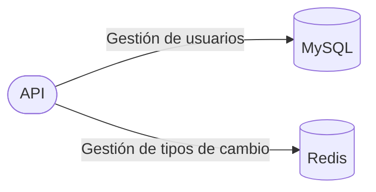

# Desafío Joyit

Este repositorio contiene el código fuente de Exchange Rate Calculator, solución al desafío técnico propuesto. El proyecto está construido con TypeScript y utiliza el framework NestJS.

## Objetivos del desafío

El desafío consiste en desarrollar una API para calcular la conversión entre dos divisas aplicando un tipo de cambio. Las consideraciones para este reto fueron:

- El lenguaje de programación a utilizar es Node JS con NestJS.

> El proyecto se construyó utilizando TypeScript, NestJs y NodeJs.

- Implementar un nivel de seguridad en la consulta (JWT).

> Se implementó el uso de JWT en los endpoints de consultas y mutaciones.

- Se debe crear la información del tipo de cambio en una in memory database.

> Se utilizó Redis como método de persistencia in-memory distribuida.

- Dockerizar la solución e invocar a la API desde el contenedor.

> El proyecto incluye la definición de la imagen de Docker, además de la configuración para ser ejecutada con Docker Compose.

- El uso de la API debe ser mostrada desde Postman.

> El uso de la aplicación será mostrado desde la misma documentación de OpenAPI pues esta es dinámica y contiene metadata útil para el usuario.

- Realizar pruebas unitarias.

> El proyecto incluye un conjunto de pruebas unitarias enfocadas principalmente en la funcionalidad requerida.

Además de los requerimientos principales arriba listados, se incluyeron las sugerencias opcionales para extender la solución del caso:

- Documentar el API con Swagger u Open api.

> La API se encuentra automaticamente documentada usando la integración de NestJS con Swagger / OpenAPI.

- Crear un POST para actualizar el valor del tipo de cambio.

> Se implementó un endpoint para tal requisito (`POST /rate`).

- Desplegar el API en AWS. (Considerar la infraestructura que mejor se te acomode).

> No se desplegó la API en algún proveedor cloud, en su lugar se utilizó Docker Compose para las pruebas funcionales.

- Utilizar NestJs con Fastify.

> El proyecto utiliza Fastify para proveer el adaptador HTTP en lugar de Express.

- Subir el código a cualquier repositorio de código fuente.

> El código de encuentra hospedado en Github.

- Implementar control de excepciones.

> Todas las excepciones están controladas usando un ExceptionFilter y son devueltas en un formato amigable hacia el cliente.

## Destacados

Adicionalmente a lo solicitado, se implementaron algunos procedimientos que facilitaron el mantenimiento y evolución del código:

- En la construcción del proyecto se utilizó la funcionalidad de Devcontainer de VSCode para automatizar y estandarizar el ambiente de desarrollo.
- Se utilizó `husky` y `lint-staged` para ejecutar tareas automáticas de validación (format, linting, tests) previas a la publicación del código en el repositorio (pre-commit / pre-push).
- Se utilizó Github Actions para ejecutar las pruebas unitarias de manera automática al integrar el código en el repositorio remoto.

### Ideas de extensión

Se listan algunas sugerencias para continuar extendiendo la solución del ejercicio.

- Usar migraciones para evolución del esquema de base de datos. TypeORM ofrece este funcionalidad.
- Almacenar las divisas disponibles en la base de datos para descoplar la dependencia en el código (`enum`).
- Utilizar un método de logging estructurado para monitorear el comportamiento del API (ej. Winston, Pino).
- Implementar un método de observabilidad para el servicio (ej. Prometheus).

## Arquitectura de la solución



## Instalación

### Requisitos

- Docker / Docker Compose

> En todos los pasos posteriores se utiliza Docker para prevenir problemas de incompatibilidad entre ambientes.

### Ejecución

Para inicializar el servicio así como sus dependencias (MySQL, Redis) utilice el siguiente comando:

```zsh
make up
```

Tras ejecutarlo, la documentación de la API estará disponible en http://localhost:8080/docs. A través de esta interfaz puede probar todas las funcionalidades de la API.

> Docker compose se encarga de realizar este proceso de provisión y ejecución.

Para eliminar completamente los contenedores luego de la ejecución, utilice el siguiente comando:

```zsh
make down
```

### Pruebas

Para ejecutar las pruebas unitarias dentro de un contenedor, ejecute el siguiente comando:

```zsh
make test
```

> Docker se encarga de la construcción de la imagen y ejecución del contenedor que ejecute las pruebas.
